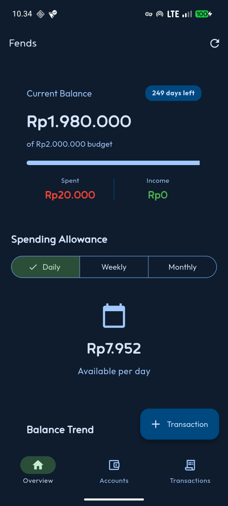
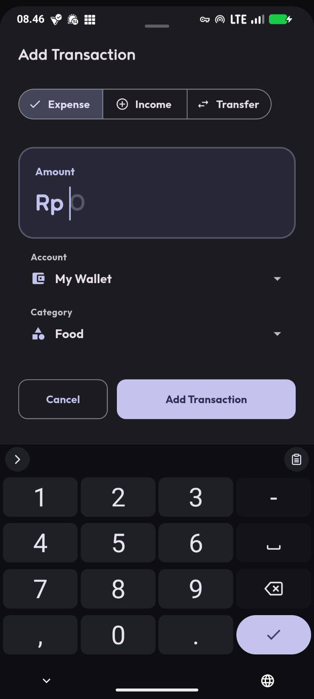
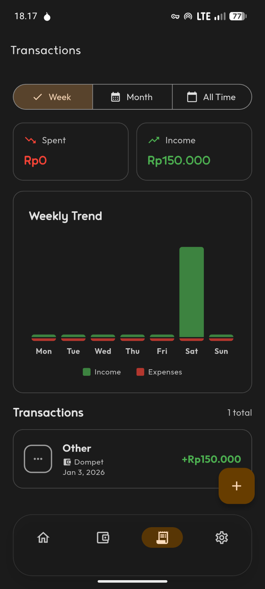
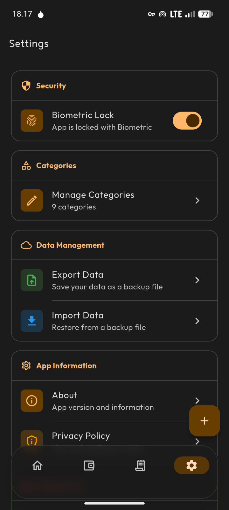

[![Latest release][release-badge]](https://github.com/felle-dev/fends-app/releases)
[![Flutter][flutter-badge]](https://flutter.dev)
[![License][license-badge]](LICENSE)

[**Fends**](https://github.com/yourusername/fends) is a simple and intuitive budget management app that helps you track your spending and take control of your finances.

Keep track of every transaction, understand your spending patterns, and make informed financial decisions. Whether you're managing daily expenses or planning for the future, Fends keeps your finances organized and accessible.

[](https://github.com/felle-dev/fends-app/releases)

## Features

- **Transaction Tracking** - Add and categorize your income and expenses
- **Transaction History** - View all your transactions in an organized list
- **Material Design 3** - Modern, clean interface following the latest design guidelines
- **Lightweight & Fast** - Built with Flutter for optimal performance
- **Privacy First** - Your data stays on your device

## Screenshots

<div style="display: flex; justify-content: space-around; gap: 10px;">
  
  
  
  
</div>

## Tech Stack

- **Language:** Dart
- **Framework:** Flutter
- **UI:** Material Design 3
- **Minimum SDK:** API 24 (Android 7.0)
- **Target SDK:** API 36

## Getting Started

### Prerequisites

- [Flutter SDK](https://flutter.dev/docs/get-started/install) (latest stable version)
- Android Studio / VS Code with Flutter extensions
- Android device or emulator (API 24+)

### Installation

1. Clone the repository
```bash
git clone https://github.com/yourusername/fends.git
cd fends
```

2. Install dependencies
```bash
flutter pub get
```

3. Run the app
```bash
flutter run
```

## Contributing

Contributions are what make the open-source community such an amazing place to learn, inspire, and create. Any contributions you make are **greatly appreciated**.

1. Fork the Project
2. Create your Feature Branch (`git checkout -b feature/AmazingFeature`)
3. Commit your Changes (`git commit -m 'Add some AmazingFeature'`)
4. Push to the Branch (`git push origin feature/AmazingFeature`)
5. Open a Pull Request

Feel free to open issues for bug reports, feature requests, or questions!

## Translations

Currently, Fends is available in English and Indonesian. If you'd like to help translate Fends into your language, please open an issue or submit a pull request with translation files.

## Support

If you find Fends useful, please consider:

- Starring the repository
- Reporting bugs or suggesting features
- Sharing Fends with friends and family
- Contributing to the codebase

## License

This project is licensed under the BSD 3-Clause License - see the [LICENSE](LICENSE) file for details.

## Author

Developed by [Felle](https://github.com/felle-dev)

[release-badge]: https://img.shields.io/github/v/release/felle-dev/fends-app?style=for-the-badge
[flutter-badge]: https://img.shields.io/badge/Flutter-02569B?style=for-the-badge&logo=flutter&logoColor=white
[license-badge]: https://img.shields.io/github/license/felle-dev/fends-app?style=for-the-badge